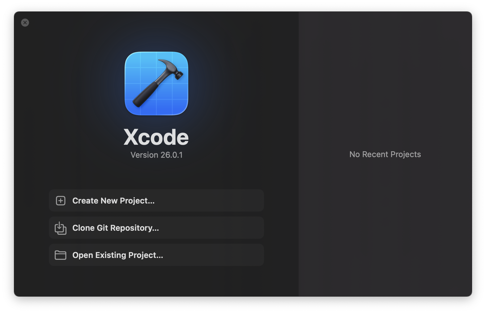
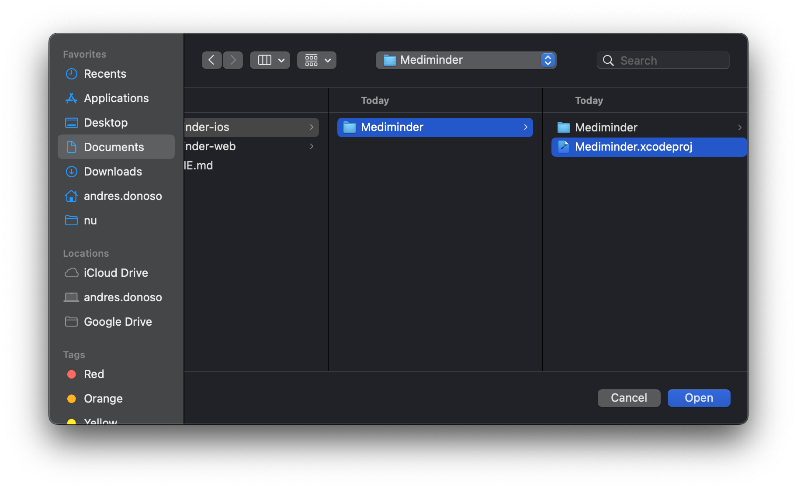
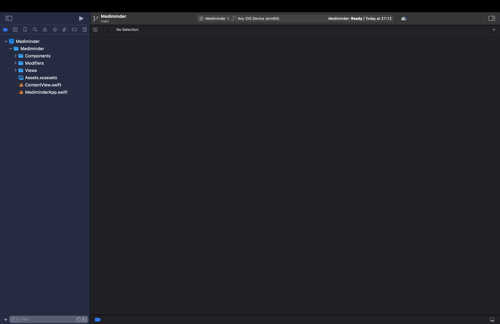
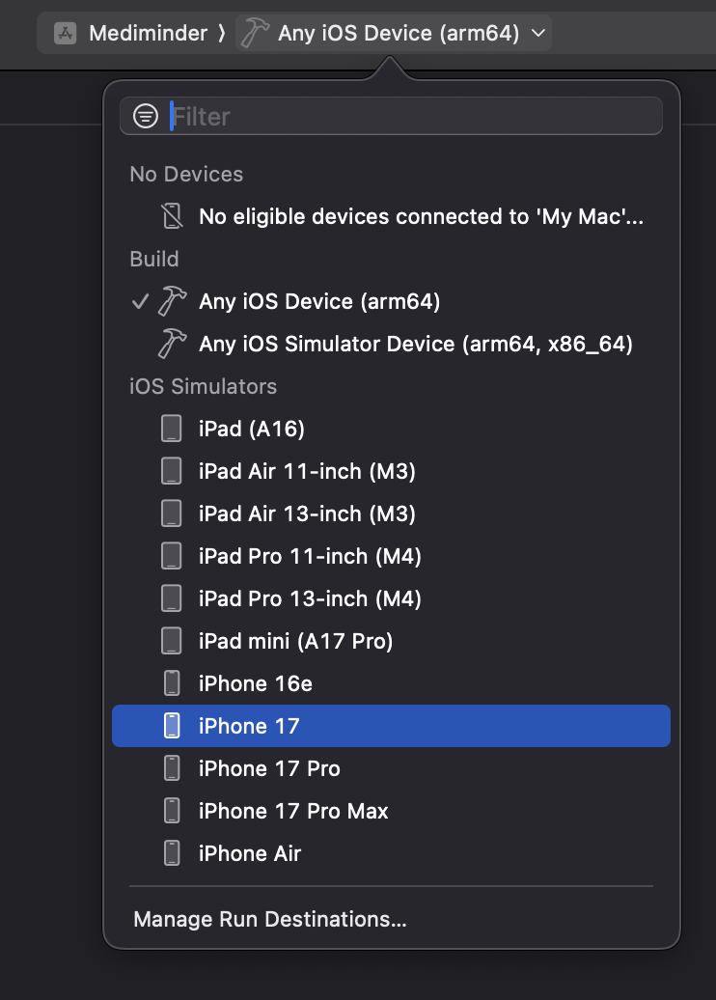
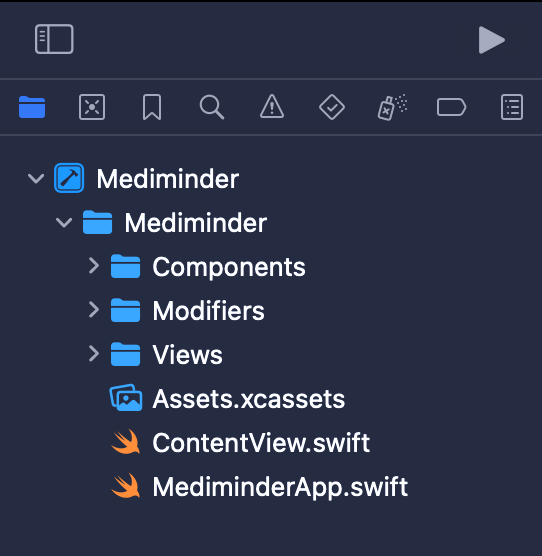
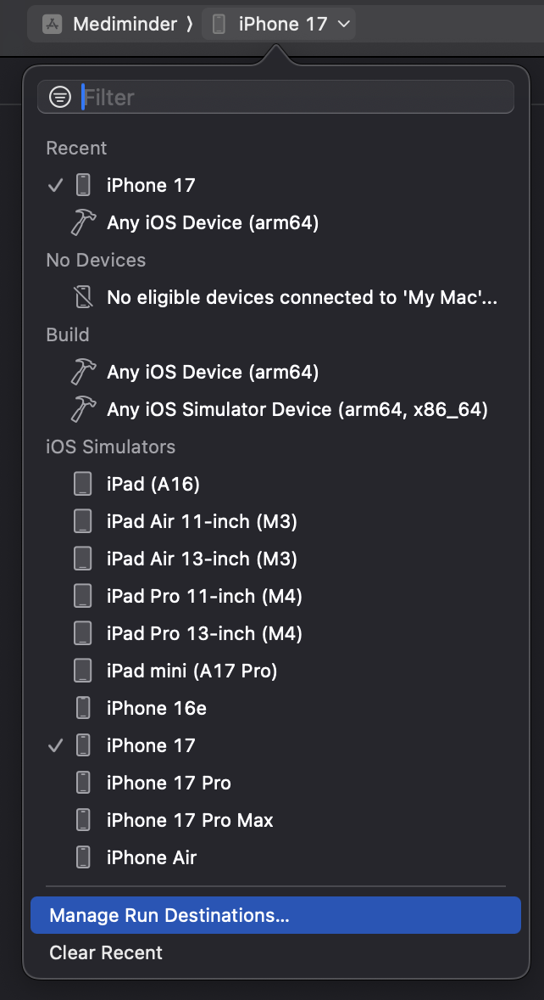
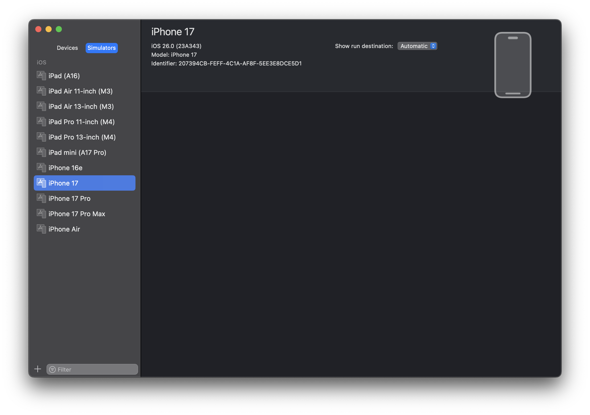
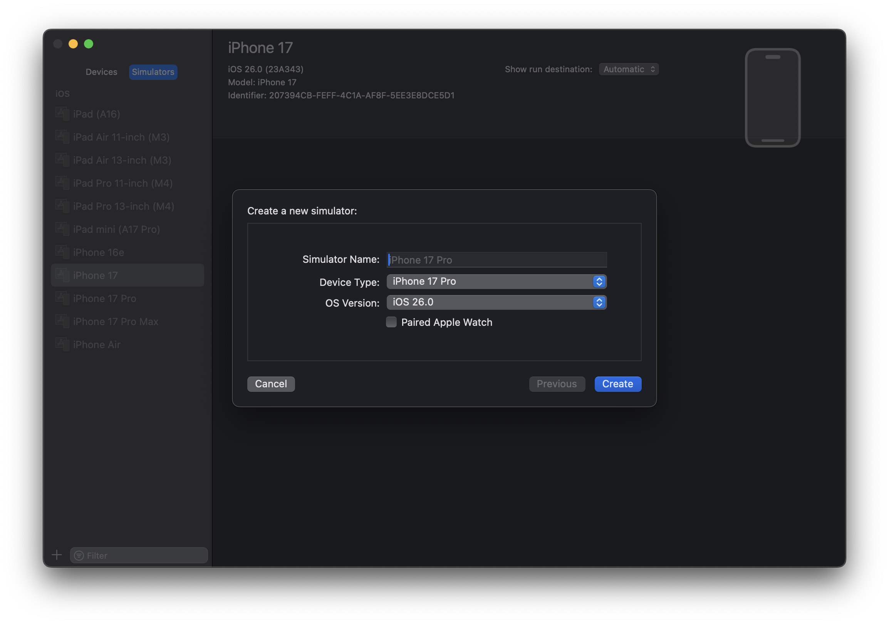
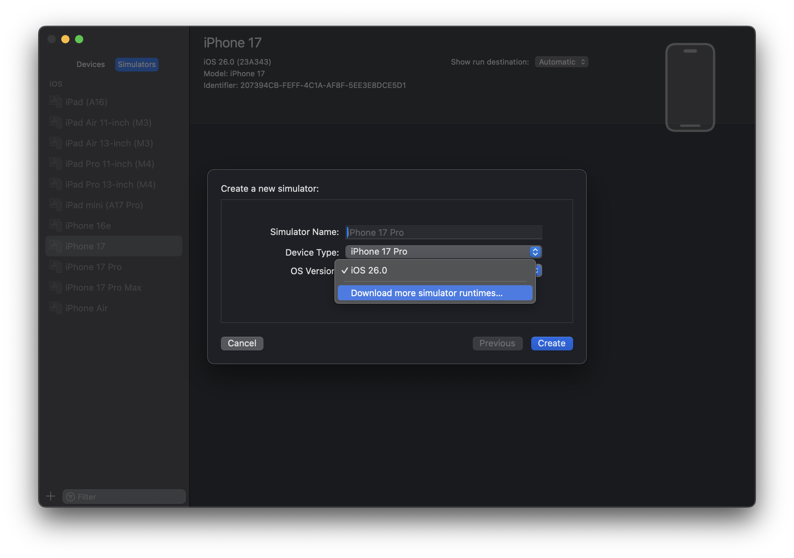
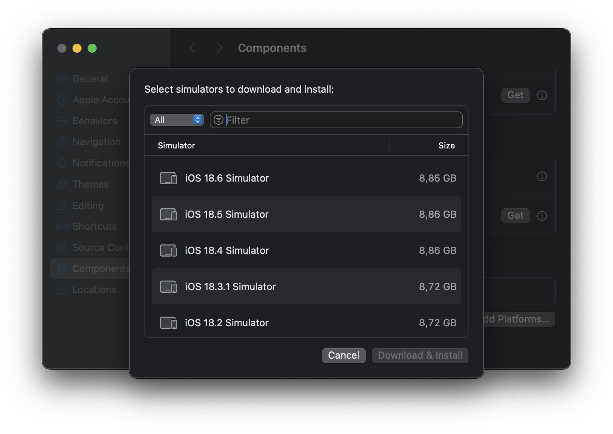

# Entregas UX

En este repositorio encontrará los 2 proyectos para UX: la versión web y la versión móvil.

La versión web está en la carpeta [mediminder-web](./mediminder-web/)

La versión iOS está en la carpeta [mediminder-ios](./mediminder-ios/)

## Distribución
### Web
- German
  - Creación de medicina
  - Detalle medicina
  - Dashboard
- Andrés
  - Login
  - Registro
  - Recuperación de contraseña

### iOS
- German
  - Paso 1 creación de medicina
  - Paso 2 creación de medicina
  - Perfil
- Andrés
  - Paso confirmación de creación de medicina
  - Listado de medicinas (vista principal)
  - Detalle de medicina

## Demos
### Web
https://github.com/user-attachments/assets/c428f96c-b7ef-4a80-9253-f8069fea6450

### iOS
https://github.com/user-attachments/assets/99d23215-0ac0-484e-9913-ff1cf6d85ca8

## Correr proyecto web
Versiones recomendadas:
- npm v10.9.0
- node v23.0.0

1. En la consola, ir a la raíz del proyecto ([mediminder-web](./mediminder-web/)).
2. Instalar las dependencias con `npm install`
3. Correr el proyecto con `npm run dev`

Esto abrirá un servidor local y le dirá la ruta donde puede ver la app.

## Correr Proyecto iOS

Para correr el proyecto de iOS es necesario instalar Xcode (se recomienda usar la última versión: **26.0.1**). También debe **instalar iOS 26.0** para el simulador, dado que esta es la versión usada en el proyecto. En caso de no tener instalada la versión 26, puede ver [esta sección](#instalar-simulador-ios-26)

### 1. Abrir proyecto
Al abrir Xcode verá la siguiente pantalla:

Seleccione la opción `Open Existing Project...`. Esto abrirá el explorador de archivos. Para abrir el proyecto, seleccione el archivo Mediminder.xcodeproj y oprima `Open`.

Esto lo llevará a la pantalla principal donde se encuentra el navegador de archivos, el editor, etc.

### 2. Seleccionar simulador
Ahora podemos seleccionar el simulador que vamos a usar para correr el proyecto. Para esto, haga click en la barra central en la parte superior central. Esto desplegará una lista de dispositivos disponibles. Seleccione en el que desee correr el proyecto.

### 3. Correr aplicación
Puede correr la aplicación de 2 formas: usando el comando `Cmd + R` o haciendo click en el botón de play en la parte superior izquierda. Esto hará un build de la aplicación, iniciará el simulador y correrá la app en él.
Este proceso puede tomar un tiempo. 

## Instalar simulador iOS 26
En caso de no tener el simulador instalado, puede seguir los siguientes pasos para hacerlo.

Haga click en la lista de dispositivos nuevamente y seleccione la opción `Manage Run Destinations...`

Esto le abrirá la siguiente ventana

Ahora oprima en el "+", lo que abrirá otra ventana.

Haga click en `OS Version` y seleccione la opción `Download more simulator runtimes...`

Finalmente le saldrá esta pantalla donde puede escoger el OS a descargar. Escoja iOS 26 y espere a que se instale.

